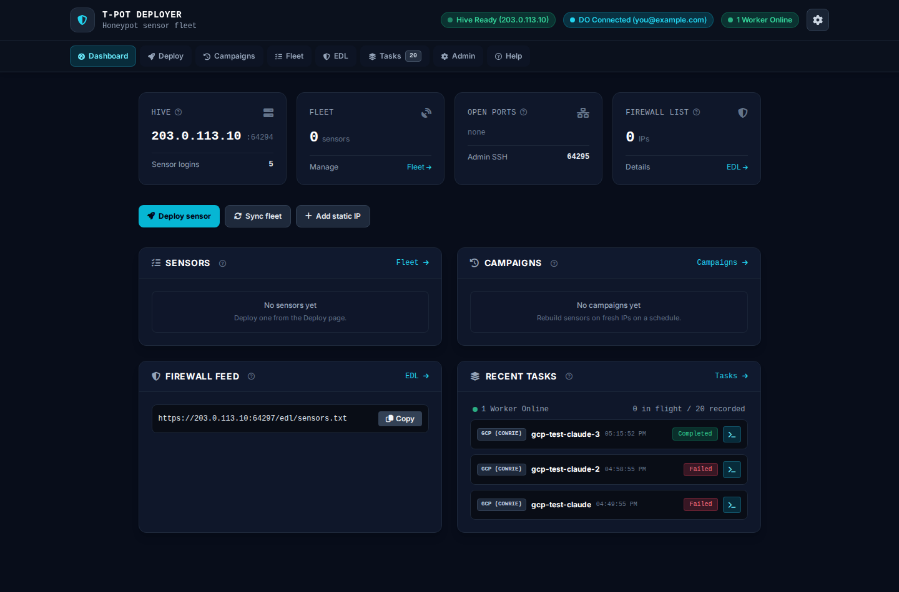
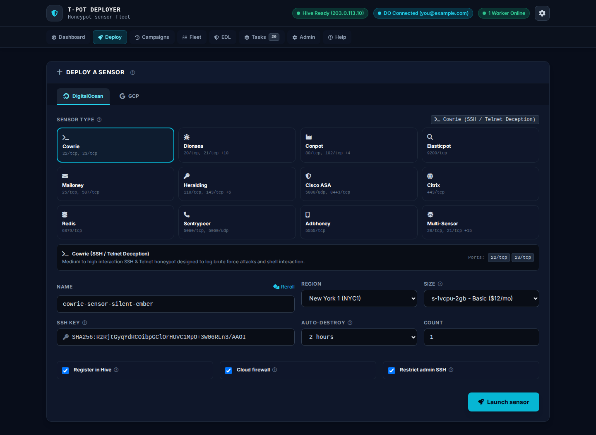
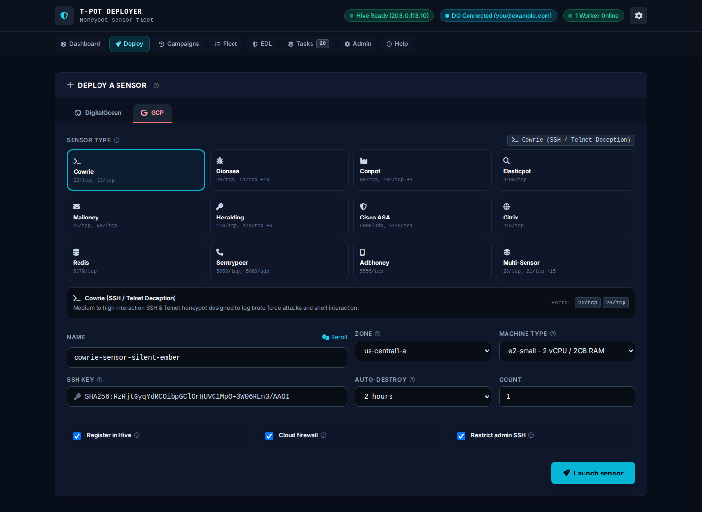
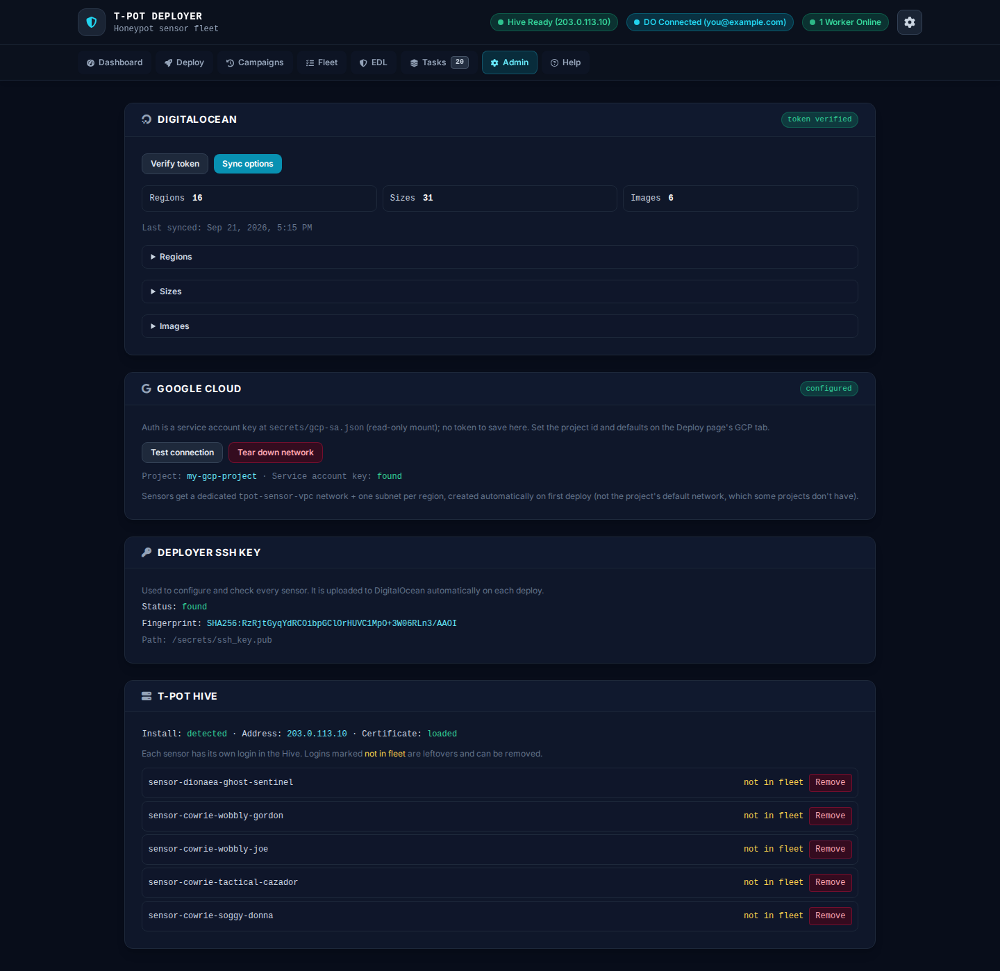
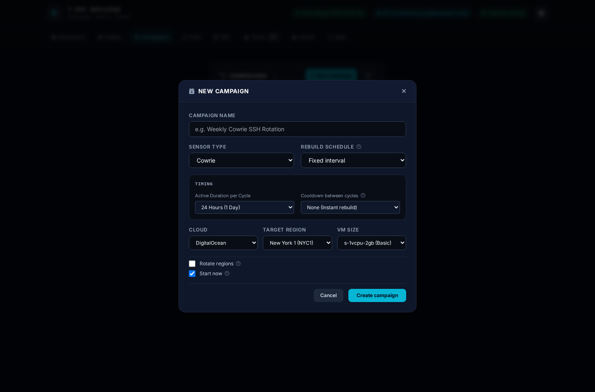
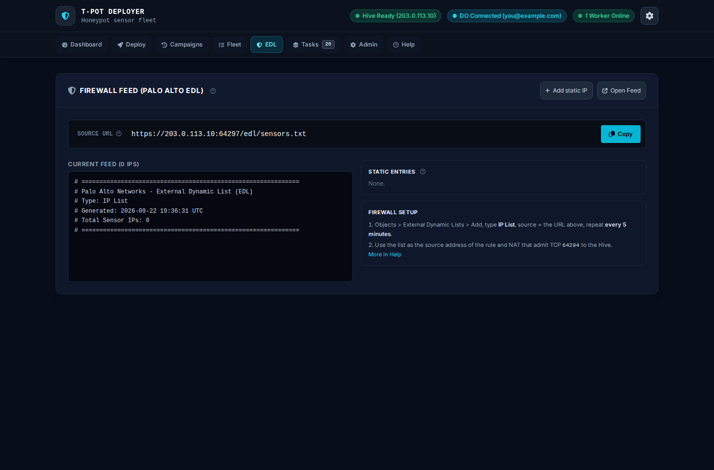

# T-Pot Sensor Deployer

A control console for deploying **[T-Pot](https://github.com/telekom-security/tpotce) honeypot sensors to the cloud** and shipping their logs into your T-Pot **Hive**. It creates a machine, configures it over SSH with Ansible, checks its health with standard tools, registers it with the Hive, publishes its IP to a Palo Alto EDL, and destroys it when its lease expires. Campaigns rebuild sensors on fresh IPs on a schedule so scanners can't fingerprint them.

<p align="center"></p>

The cloud API is used only to **create and destroy machines** (and to list options like regions and sizes). Everything that happens on a machine afterwards is cloud-agnostic: plain SSH, Ansible playbooks and ping/TCP checks. Adding another cloud means adding a way to make and delete a machine; the sensor setup and health checks don't change. **DigitalOcean and GCP** are both fully wired up today — two providers a home-lab operator can actually get an account on in five minutes, no business verification required.

> **Status:** DigitalOcean deploys and campaigns work end to end for all 12 catalog sensor types (see [docs/HONEYPOT_CATALOG.md](docs/HONEYPOT_CATALOG.md)), each deployed and health-checked on a real droplet. GCP manual deploys and campaigns use the same create-then-Ansible pipeline as DigitalOcean and are verified the same way for **Cowrie**; the rest should work (identical shared code) but aren't each individually confirmed on a real GCP instance yet. AWS and Azure are out of scope for now.

## How it works

```
 you (browser) ──► T-Pot nginx :64297 /sensors/ ──► web (FastAPI) ──► redis ──► worker
                                                        │                        │
                                                        │              ┌─────────┴───────────┐
                                                        ▼              ▼                     ▼
                                                  SQLite (/data)   DO / GCP API         Ansible over SSH
                                                                   create / destroy      to the sensor
                                                                                              │
   Palo Alto EDL  ◄── /edl/sensors.txt        T-Pot Hive  ◄── Logstash (TLS + basic auth) ◄───┘
```

1. **Register** the sensor's own log-shipping login in the Hive, then **create** a bare machine (no user-data / startup script) with the deployer's SSH key attached.
2. **Track** it immediately (database record and TTL lease) so a failed setup can never leave an untracked, billing machine, and **publish its IP** to the EDL so the firewall can admit it while it is still being set up.
3. **Configure** it with `playbooks/sensors/<type>.yml`: swap, Docker, the T-Pot sensor stack, the Hive certificate, and admin SSH moved off port 22.
4. **Check** it with `playbooks/health/<type>.yml`: containers running and not crash-looping, Logstash pipeline up, honeypot ports listening, Hive reachable (waiting a bounded time for the firewall to admit it).
5. **Destroy** it when the TTL expires (or on demand), removing its Hive login and EDL entry.

The **worker** process does all of this in the background, including campaign scheduling (every 10 s) and TTL sweeps (every 60 s). The web UI only enqueues work and shows progress.

## Deploy to either cloud

The Deploy page is one form with a cloud tab, not two different tools — pick a sensor type once, then DigitalOcean and GCP show the same fields (name, region/zone, size/machine type, auto-destroy, count, firewall toggles) so switching providers is a tab click, not a different mental model.

<p align="center">
  
  
</p>

Both **Admin** panels look the same way for the same reason — DigitalOcean's token status and GCP's service account/project status side by side, plus the deployer's SSH key and the Hive's registered sensor logins:

<p align="center"></p>

## Campaigns

A campaign runs a sensor for a window, destroys it, and rebuilds it later on a fresh dynamic IP — weekly, on a fixed interval, or a randomized rebuild window — so scanners like Shodan or Censys can't fingerprint a stable address. Campaign machines get an independent TTL backstop lease too, the same safety net a manual deploy always had, so a stuck campaign (or one paused while its sensor is active) can never turn into a forgotten, indefinitely-running bill.

<p align="center"></p>

## Firewall integration

Every tracked sensor's IP is published as a plaintext [External Dynamic List](docs/PALO_ALTO_EDL.md) a Palo Alto (or any EDL-capable) firewall can poll directly — no separate sync step.

<p align="center"></p>

## Requirements

- Docker with Compose, on the same host as a T-Pot **[Hive](https://github.com/telekom-security/tpotce)** (the deployer writes to the Hive's `tpotce` directory to register sensors).
- A DigitalOcean API token (read and write), and/or a GCP project with a service account key (Compute Admin role) — deploy to either or both.
- An SSH key pair for the deployer. The private key configures sensors; the public key is uploaded to DigitalOcean and injected into GCP instance metadata.
- A Palo Alto (or other) firewall that admits sensor IPs to the Hive's log port `64294` (see [docs/PALO_ALTO_EDL.md](docs/PALO_ALTO_EDL.md)).

## Quick start

```bash
cp .env.example .env              # set TPOT_HOST_DIR (path to your tpotce), PUID/PGID, DO_TOKEN
mkdir -p secrets
cp ~/.ssh/id_rsa     secrets/ssh_key      # private key Ansible logs in with
cp ~/.ssh/id_rsa.pub secrets/ssh_key.pub  # matching public key, uploaded to DigitalOcean
docker compose up -d --build
```

Then add the location blocks from [`nginx/tpot-location.conf`](nginx/tpot-location.conf) to T-Pot's nginx and reload it. The console is at `https://<hive>:64297/sensors/` (T-Pot's own login), or directly at `http://127.0.0.1:8880/`.

Open **Admin**, click *Verify token* and *Sync options* (DigitalOcean), or set a project id and drop a service account key at `secrets/gcp-sa.json` and click *Test connection* (GCP), then use **Deploy**.

Code is baked into the image, so after any change run `docker compose up -d --build`.

## Configuration

Set in `.env` (read by Compose):

| Variable | Purpose |
| :--- | :--- |
| `TPOT_HOST_DIR` | **Required.** Host path of the T-Pot install; mounted at `/tpot` |
| `PUID` / `PGID` / `TPOT_GID` | UID/GID the containers run as; must be able to write `$TPOT_HOST_DIR/data/nginx/conf` and `.env` |
| `WEB_BIND` / `WEB_PORT` | Published address/port of the web container (default `127.0.0.1:8880`) |
| `SECRETS_HOST_DIR` | Folder mounted read-only at `/secrets` (default `./secrets`) |
| `DO_TOKEN` | DigitalOcean token (can also be saved from the UI, which stores it in the database) |
| `GCP_PROJECT_ID` | GCP project id (can also be saved from the UI). Auth is `secrets/gcp-sa.json`, not a token |
| `TPOT_HIVE_IP` | Public IP/FQDN of the Hive (auto-detected if blank) |
| `HIVE_ADMIT_WAIT_SECONDS` | How long a deploy waits for the firewall to admit a new sensor to the Hive (default 480) |

Files in `secrets/`: `ssh_key` (private), `ssh_key.pub`, and `gcp-sa.json` (GCP service account key, Compute Admin role). The folder is gitignored.

All state (SQLite database, settings, logs, EDL file, Terraform state) lives in the `deployer_data` Docker volume at `/data`.

## Pages

| Page | What it does |
| :--- | :--- |
| **Dashboard** | Summary cards and live previews |
| **Deploy** | Pick a sensor type, provider, region/zone, size and TTL, then launch |
| **Fleet** | Active sensors, TTL controls, health, destroy |
| **Campaigns** | Recurring "run, destroy, rebuild on a new IP" schedules, either provider |
| **EDL** | The Palo Alto feed, static entries, PAN-OS notes |
| **Tasks** | Worker status, task history, replayable live logs |
| **Admin** | DigitalOcean token / GCP project status, option sync, the deployer SSH key, Hive status and registered sensor logins |
| **Help** | What each thing does, how a deploy works, firewall setup and troubleshooting (a static page, `app/static/help.html`) |

## Documentation

- [Architecture](docs/ARCHITECTURE.md): components, deploy pipeline, campaigns, state, ports
- [Playbooks](docs/PLAYBOOKS.md): how sensors are configured and checked, and how to add a sensor type
- [Operations](docs/OPERATIONS.md): running it, day-to-day tasks, troubleshooting
- [Sensor catalog](docs/HONEYPOT_CATALOG.md): the supported sensor types and their status
- [Palo Alto EDL](docs/PALO_ALTO_EDL.md): firewall integration
- [CLAUDE.md](CLAUDE.md): notes for anyone (human or AI) changing the code

## Tests

```bash
python3 tests/test_sqlite_db.py
python3 tests/test_multi_sensors.py
python3 tests/test_gcp_client.py
```

Each test file points the app at temporary data and Hive directories before importing it, so tests can never touch real state. `tests/test_worker_queue.py` needs a live Redis: `docker compose exec web python3 tests/test_worker_queue.py`.

## License

[MIT](LICENSE)
